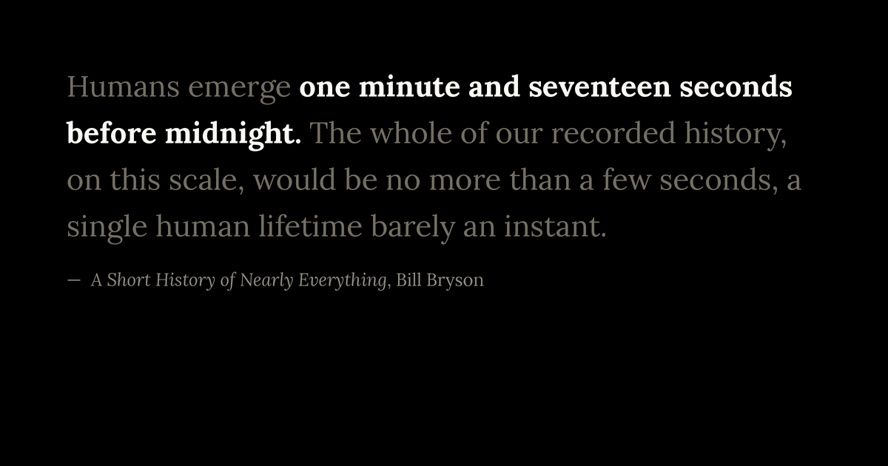

# MMM-LiteraryClock


A **literary clock** for [MagicMirror²](https://magicmirror.builders/). Every
minute it shows a passage from a book that mentions the current time, with the
time phrase emphasised — so you read the time straight off the page.



At 12:00 you might get *Romeo and Juliet* ("the dial is now upon the prick of
**noon**"); at 09:00, *Death in Venice*; at 23:58, Bill Bryson. There's a quote
for **1432 of the 1440 minutes** in a day.

It ships with its own serif (**Lora**, bundled locally — no Google Fonts call at
runtime) and page-like styling, and overrides MagicMirror's default font so it
actually reads like a book. There are **no external dependencies**.

## Install

```bash
cd ~/MagicMirror/modules
git clone https://github.com/bwente/MMM-LiteraryClock.git
```

No `npm install` step is required. Then add the module to `config/config.js`:

```js
{
  module: "MMM-LiteraryClock",
  position: "middle_center",
  config: {
    fontSize: 28,
    quoteColor: "#736e62",
    timeColor: "#fbf9f4"
  }
}
```

Restart the mirror (e.g. `pm2 restart MagicMirror`).

## Configuration

All options are optional; defaults are shown.

| Option | Default | Description |
|--------|---------|-------------|
| `fontSize` | `28` | Quote body size in px. `maxWidth` scales with it. |
| `maxWidth` | `"34em"` | Text measure. Narrower breaks more like a printed page. |
| `quoteColor` | `"#736e62"` | Body text colour. Kept dim on purpose — the gap to `timeColor` is what makes the time readable at a glance. |
| `timeColor` | `"#fbf9f4"` | Colour of the emphasised time phrase (also used for the digital fallback). |
| `attributionColor` | `"#8f8b82"` | Colour of the "— Title, Author" line. |
| `showAttribution` | `true` | Show the title/author line. |
| `updateOnMinute` | `true` | Refresh exactly on the minute boundary. |
| `refreshMinutes` | `1` | Only used when `updateOnMinute` is `false`: refresh every N minutes (useful for e-ink). |
| `fadeSpeed` | `1500` | Crossfade duration in ms when the quote changes. |
| `allowNSFW` | `false` | Include quotes flagged `nsfw` in the source data. |
| `allowUnknown` | `true` | Include quotes with an `unknown` rating. Most of the corpus is unrated, so turning this off gives sfw-only but drops coverage sharply. |
| `dataFile` | `""` | Path to an alternative dataset (see below). Blank uses the bundled English CSV. |

## Deeper styling

The two or three knobs above cover most needs. For anything more, every rule is
scoped to `.MMM-LiteraryClock`, so you can override it from your mirror's
`css/custom.css` without touching this module:

```css
.MMM-LiteraryClock .litclock-quote { line-height: 1.7; }
.MMM-LiteraryClock .litclock-time  { text-shadow: 0 0 2px rgba(255,255,255,.5); }
```

To swap the typeface, drop new `woff2` files into `fonts/` and update the
`@font-face` `src` URLs at the top of `MMM-LiteraryClock.css`.

## Other languages / custom datasets

The clock is not English-locked. Point `dataFile` at any pipe-delimited dataset
in the same format:

```
time|timePhrase|quote|title|author|sfw
23:58|before midnight|Humans emerge one minute...|A Short History...|Bill Bryson|sfw
```

`time` is `HH:MM` (24-hour), `timePhrase` is the exact substring of the quote to
emphasise, and `sfw` is one of `sfw` / `nsfw` / `unknown`. Relative paths resolve
against the module folder:

```js
config: { dataFile: "datasets/litclock_de.csv" }
```

The [literature-clock project](https://github.com/JohannesNE/literature-clock)
and its forks maintain datasets in several languages.

## Coverage & fallback

1432 of 1440 minutes have at least one quote. For an uncovered minute, or when
the selected safety filters leave no matching quote for that minute, the module
shows a plain digital `HH:MM` rather than displaying a quote for the wrong time.

## Testing

```bash
npm test
```

Runs a small suite (Node's built-in test runner, no dependencies) covering
dataset parsing, full-day coverage, and time-phrase highlighting.

## Credits & licence

- **Module code** — MIT (see [LICENSE](LICENSE)).
- **Quote data** (`litclock_annotated.csv`) — compiled by the
  [literature-clock](https://github.com/JohannesNE/literature-clock) project,
  originally **crowd-sourced by The Guardian** and inspired by **Jaap Meijers'**
  [e-reader clock](https://www.instructables.com/id/Literary-Clock-Made-From-E-reader/).
  The quotations are short excerpts from their respective copyrighted works,
  included for the literary-clock purpose; they remain the property of their
  rights holders and are **not** covered by this module's MIT licence.
- **Font** — [Lora](https://fonts.google.com/specimen/Lora) by Cyreal, under the
  SIL Open Font License v1.1 (bundled as [fonts/OFL.txt](fonts/OFL.txt)).

Not affiliated with, or endorsed by, The Guardian. If you are a rights holder
and would like a quotation removed, please open an issue.
